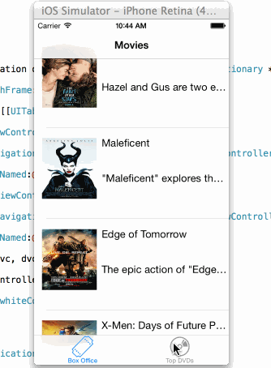

RottenTomatoes2
===============

# RottenTomatoes app Demo

 
This is an iOS demo application for displaying the latest box office movies using the [RottenTomatoes API](http://www.rottentomatoes.com/).

Completed user stories:

 * [x] Required: User can view a list of movies from Rotten Tomatoes.  Poster images must be loading asynchronously.
 * [x] Required: User can view movie details by tapping on a cell
 * [x] Optional: Add a tab bar for Box Office and DVD
 
Notes:

Spent some time trying to  Customize the highlight and selection effect of the cell, couldnt get the complete synopsis highlighting work.

Walkthrough of all user stories:

GIF created with [LiceCap](http://www.cockos.com/licecap/).

